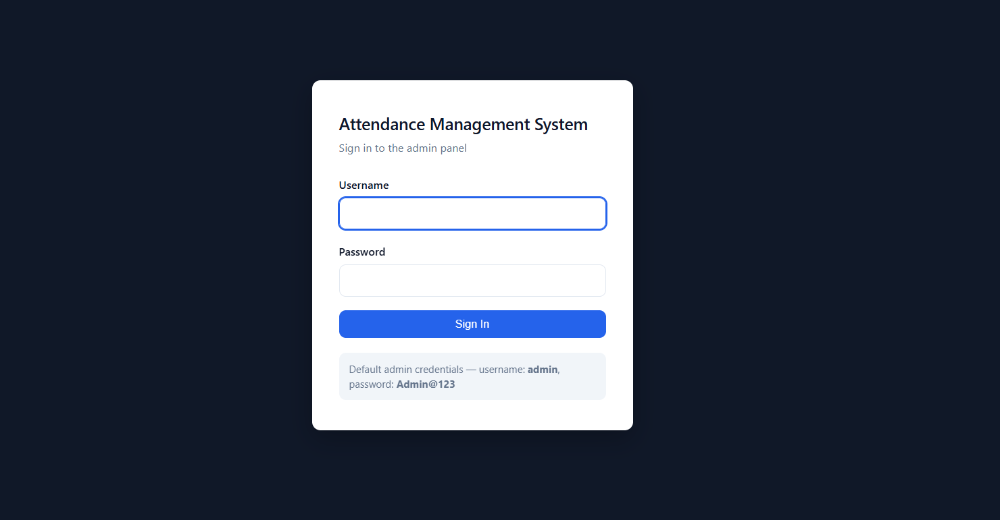
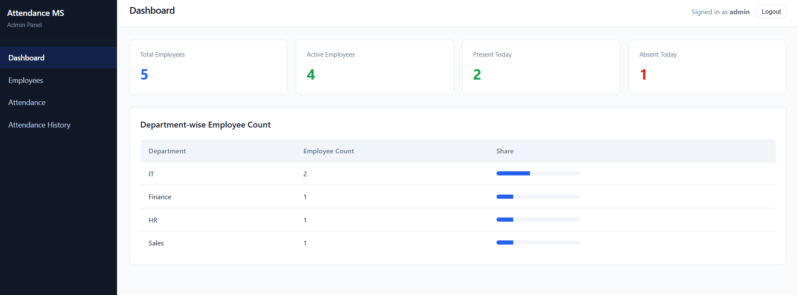
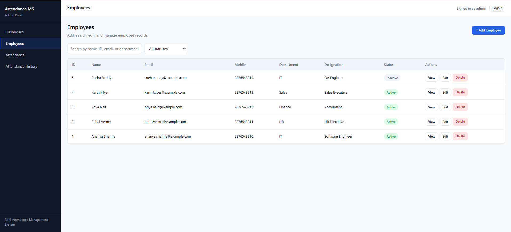
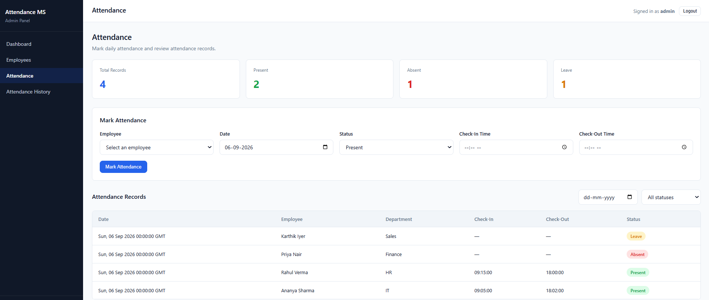

# Mini Attendance Management System

A full-stack web application that allows an administrator to log in, manage employees, mark and review attendance, and view attendance statistics on a dashboard.

**Stack:** React (Vite) → Flask REST API → MySQL

---

## 1. Project Overview

This is a CRUD-based attendance management application where an admin can manage employees and record their daily attendance. The dashboard provides attendance statistics and employee information.

### Objective

The objective of this project is to demonstrate an end-to-end full-stack web application using a React frontend, Flask REST API, and MySQL database with authentication, validation, and error handling.

---

## 2. Features

* **Authentication** — Admin login with password hashing and JWT-based authentication.
* **Employee Management** — Add, view, search, edit, and delete employees.
* **Attendance Management** — Mark attendance as Present, Absent, or Leave with check-in and check-out times.
* **Attendance History** — View attendance records and employee attendance history.
* **Dashboard** — View total employees, active employees, present/absent employees, and department-wise employee information.
* **Validation & Error Handling** — Input validation and meaningful error responses on the frontend and backend.

---

## 3. Technology Stack

| Layer          | Technology                        |
| -------------- | --------------------------------- |
| Frontend       | React 18, Vite, React Router, CSS |
| Backend        | Python, Flask, Flask-CORS, PyJWT  |
| Database       | MySQL                             |
| Authentication | Werkzeug password hashing + JWT   |
| API Testing    | Postman                           |

---

## 4. Architecture

```text
┌─────────────────┐       HTTP/JSON       ┌─────────────────┐       SQL       ┌─────────────────┐
│  React (Vite)   │ ────────────────────> │   Flask REST    │ ─────────────> │      MySQL      │
│     :5173       │ <──────────────────── │     API :5000   │ <───────────── │  attendance_db  │
└─────────────────┘                       └─────────────────┘                 └─────────────────┘
```

* The React application communicates with the Flask REST API.
* Flask handles authentication, validation, API requests, and database operations.
* MySQL stores employee, attendance, and user information.

---

## 5. Database Design

The application contains three main tables:

* `users`
* `employees`
* `attendance`

### Relationship

```text
employees (1) ───────────< (many) attendance
   employee_id                 employee_id (FK)
```

### Tables

**users**

Stores administrator login information. Passwords are stored using password hashing.

**employees**

Stores employee name, email, mobile number, department, designation, and status.

**attendance**

Stores attendance records for employees by date, including attendance status and check-in/check-out information.

### Database Constraints

* Primary keys for table identification.
* Unique employee email.
* Unique employee/date attendance combination.
* Foreign key between `employees` and `attendance`.
* Input validation for employee information.
* Created and updated timestamp fields.

---

## 6. Database Relationships

One employee can have multiple attendance records.

This is a **one-to-many relationship**:

```text
One Employee
     │
     ├── Attendance Record
     ├── Attendance Record
     └── Attendance Record
```

---

## 7. API Endpoints

| Method | Endpoint                        | Purpose                     |
| ------ | ------------------------------- | --------------------------- |
| POST   | `/api/auth/login`               | Admin login                 |
| POST   | `/api/employees`                | Create employee             |
| GET    | `/api/employees`                | List employees              |
| GET    | `/api/employees/<id>`           | Get employee details        |
| PUT    | `/api/employees/<id>`           | Update employee             |
| DELETE | `/api/employees/<id>`           | Delete employee             |
| POST   | `/api/attendance`               | Mark attendance             |
| GET    | `/api/attendance`               | List attendance records     |
| GET    | `/api/attendance/summary`       | Attendance summary          |
| GET    | `/api/attendance/employee/<id>` | Employee attendance history |
| GET    | `/api/dashboard/stats`          | Dashboard statistics        |
| GET    | `/api/health`                   | API health check            |

---

## 8. Folder Structure

```text
attendance-management-system/
│
├── backend/
│   ├── app.py
│   ├── config.py
│   ├── requirements.txt
│   ├── .env.example
│   │
│   ├── database/
│   │   └── db.py
│   │
│   ├── routes/
│   │   ├── auth_routes.py
│   │   ├── employee_routes.py
│   │   ├── attendance_routes.py
│   │   └── dashboard_routes.py
│   │
│   └── utils/
│       ├── auth.py
│       ├── validators.py
│       └── responses.py
│
├── frontend/
│   ├── src/
│   │   ├── main.jsx
│   │   ├── App.jsx
│   │   ├── context/
│   │   ├── hooks/
│   │   ├── services/
│   │   ├── components/
│   │   ├── pages/
│   │   └── utils/
│   │
│   └── package.json
│
├── database/
│   └── attendance.sql
│
├── postman/
│   └── attendance-management.postman_collection.json
│
├── screenshots/
│   ├── login.png
│   ├── dashboard.png
│   ├── employees.png
│   └── attendance.png
│
├── README.md
├── INTERVIEW_GUIDE.md
├── TESTING_CHECKLIST.md
└── .gitignore
```

---

## 9. Prerequisites

Before running the project, install:

* Python 3.10+
* Node.js 18+ and npm
* MySQL

---

## 10. Database Setup

From the project root, run:

```bash
mysql -u root -p < database/attendance.sql
```

The SQL script:

1. Creates the `attendance_db` database.
2. Creates the `attendance_user` database user.
3. Creates the `users`, `employees`, and `attendance` tables.
4. Inserts sample data.

### Database Details

```text
Database: attendance_db
Username: attendance_user
Password: attendance_pass
Host: localhost
Port: 3306
```

---

## 11. Backend Setup

Open a terminal and run:

```bash
cd backend
python -m venv venv
```

### Windows

```bash
venv\Scripts\activate
```

### Install dependencies

```bash
pip install -r requirements.txt
```

Create a `.env` file using `.env.example` and configure the database details.

Then start the backend:

```bash
python app.py
```

The API runs at:

```text
http://localhost:5000
```

### Environment Variables

| Variable           | Example                 |
| ------------------ | ----------------------- |
| `DB_HOST`          | `localhost`             |
| `DB_PORT`          | `3306`                  |
| `DB_USER`          | `attendance_user`       |
| `DB_PASSWORD`      | `attendance_pass`       |
| `DB_NAME`          | `attendance_db`         |
| `FLASK_DEBUG`      | `True`                  |
| `JWT_SECRET_KEY`   | Your secret key         |
| `JWT_EXPIRY_HOURS` | `8`                     |
| `FRONTEND_ORIGIN`  | `http://localhost:5173` |

---

## 12. Frontend Setup

Open another terminal:

```bash
cd frontend
npm install
npm run dev
```

The frontend runs at:

```text
http://localhost:5173
```

---

## 13. How to Run the Application

Follow these steps:

### Step 1 — Start MySQL

Start the MySQL server.

### Step 2 — Start Backend

```bash
cd backend
venv\Scripts\activate
python app.py
```

### Step 3 — Start Frontend

Open another terminal:

```bash
cd frontend
npm run dev
```

### Step 4 — Open the Application

Open:

```text
http://localhost:5173
```

---

## 14. Default Login

| Username | Password    |
| -------- | ----------- |
| `admin`  | `Admin@123` |

---

## 15. Screenshots

### Login



### Dashboard



### Employees



### Attendance



---

## 16. Future Improvements

* Soft-delete employees to preserve attendance history.
* Add pagination for employees and attendance records.
* Add role-based access control.
* Add CSV export for attendance reports.
* Add automated backend and frontend tests.
* Add database connection pooling.
* Add refresh tokens for authentication.

---

## 17. Conclusion

The Mini Attendance Management System demonstrates a complete full-stack application with a React frontend, Flask REST API, MySQL database, authentication, employee management, attendance management, and dashboard reporting.
